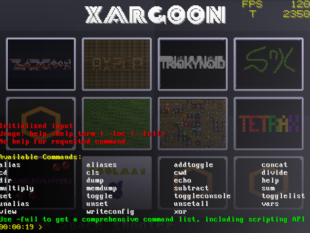

# BlackBox


## Project Description
This is a multi-purpose game engine written in python using pygame library.
The engine client can request contents to a master server, therefore allowing for updates or multiplayer connections.

Live Demo: @ https://blackbox.iskarion.ddns.net/



## Install / Deploy Instructions
 1. Clone Repository
    ```bash
    git clone git@github.com:pinakure/BlackBox.git /src/blackbox
    ```
 2. Get up the container
    ```bash
    cd /src/blackbox
    docker compose up --build -d
    ```
## Compiling / Debugging the Client
  1. Attach to client container
     ```bash
     docker exec -it bash
     ```
  2. Enable aliases
     ```bash
     source ./aliases.sh
     ```
  3. Run compile script
     ```bash
     compile
     ```
  4. Run debugging script
     ```bash
     debug
     ```
# Client
The game client can be manipulated using a command line.\
Summon the console interface during runtime by pressing F1.
## Available commands
    alias                    Set given alias for a command line
    aliases                  Show list of current aliases
    addtoggle                Adds a toggle with given id and name
    concat                   Concatenate given arguments and store the value in $result
    cd                       Changes active working directory
    cls                      Clear console buffer
    cwd                      Shows active working directory
    divide                   Divide given operators and store the value in $result
    dir                      Shows files and folders in current working directory
    dump                     Dump console buffer into given filename
    echo                     Dump given text on the console buffer
    help                     Show help about requested command
    multiply                 Multiply given operators and store the value in $result
    memdump                  Dump heap blocks to the filesystem
    subtract                 Subtract given operators and store the value in $result
    sum                      Sum given operators and store the value in $result
    set                      Set or view value of given variable
    toggle                   Set or toggle given in-game toggle
    toggleconsole            Open or close the console interface
    togglelist               Show list of current in-game toggles
    unalias                  Unset given alias
    unset                    Unset given variable
    unsetall                 Unsets every variable set
    vars                     Show list of defined variables
    view                     Dump given filename over the console
    writeconfig              Stores variable settings under given filename
    xor                      Apply XOR over given value and store value in $result

## Scripting API
### blackbox module

        ctrlc ()             Return TRUE if CTRL+C was pressed
        version ()           Return current BlackBox engine version
        epoch ()             Return current engine epoch uptime

### console module
    
        print (text)        Dump given text over console"
        cls ()              Clean console buffer"

### vpu module
VPU stands for __Video Processing Unit__. This module encapsulates all video operations.

        createanim ( width, height, sprite_handle )     Return Handle to new Animation object
        createsprite ( width, height, filename )        Return Handle to Sprite object 
        createsurf ( width, height )                    Return Handle to Surface object
        dimensions(  )                                  Return selected bitmap [ width, height ]
        disable( layer )                                Toggle off given VPU layer
        deleteanim( handle )                            Delete Animation by Handle
        deletesprite( handle )                          Delete Sprite by Handle
        deletesurf( handle )                            Delete Surface by Handle
        drawanim( handle, x, y )                        Draw animation by handle at given coordinates
        drawsprite( handle, x, y )                      Draw Sprite by handle at given coordinates
        drawsurf( handle, x, y )                        Draw surface by handle at given coordinates
        enable( layer )                                 Toggle on given VPU layer
        fadein(  )                                      Fade screen from black
        fadeout(  )                                     Fade screen to black
        fill( r, g, b, a )                              Fill selected bitmap with color or fallback to default
        frames(  )                                      Return actual frame count
        fullscreen( enabled )                           Set fullscreen mode
        print( text, x, y )                             Print given text at given coordinates
        pset( x, y )                                    Draw pixel on selected surface at given coordinates
        restart(  )                                     Restart VPU
        rotate( layer, angle )                          Rotate specified layer (0-11) given degrees
        scale( layer, scale_x, scale_y )                Alter specified layer [0-11] X and Y scale factor
        select( layer )                                 Select a layer as target to perform graphic operations
        setcolor( r, g, b, a )                          Set the active painting color
        setrotation( layer, angle )                     Set rotation for a layer (0-11) as specified degrees
        setscale( layer, scale_x, scale_y )             Set scale for layer [0-11] given X and Y values
        update(  )                                      Force screen updating and input polling. 
                                                        Use in blocking calls to keep the engine running normally.

## Dependencies
### XMing (EXPERIMENTAL) 
Since the engine is running on a docker container with strict dependencies fulfilled, getting the video output from the engine can be tricky.\
If you are using a windows host, consider using XMing or similar X Server Software to allow
the video output to be shown on the client side.